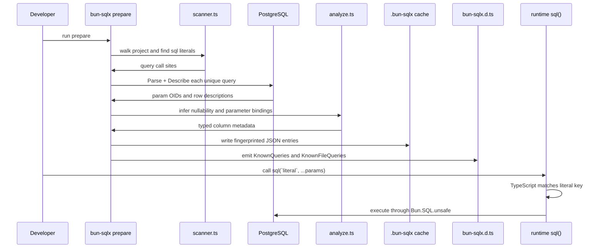

`bun-sqlx` is split into two halves: a compile-time pipeline that scans and validates queries, and a runtime layer that intentionally does very little beyond executing the exact SQL string the compiler already approved.

## Module Map

```mermaid
graph TD
  A[Source files .ts .tsx] --> B[src/scan/scanner.ts]
  B --> C[src/commands/prepare.ts]
  C --> D[src/pg/wire.ts]
  D --> E[PostgreSQL Parse + Describe]
  C --> F[src/pg/schema.ts]
  C --> G[src/pg/analyze.ts]
  G --> H[src/pg/narrow.ts]
  C --> I[src/pg/param-map.ts]
  C --> J[src/cache.ts]
  C --> K[src/codegen.ts]
  K --> L[bun-sqlx.d.ts]
  L --> M[src/index.ts TypedSql surface]
  N[src/runtime.ts] --> O[Bun.SQL.unsafe]
  M --> N
  P[bin/bun-sqlx.ts CLI] --> C
  P --> Q[src/commands/migrate.ts]
```

The library entry point in `src/index.ts` exports only the public surface: `sql`, `unsafe`, migration helpers, client helpers, and type aliases. The heavy lifting sits behind the CLI and the `prepare` command in `src/commands/prepare.ts`.

## Data Lifecycle

This separation is deliberate. The runtime in `src/runtime.ts` does not parse SQL, reflect on the schema, or re-check types. It reads the SQL file cache for `sql.file(...)`, renames alias suffixes such as `"id!"`, and delegates execution to `Bun.SQL`.

## Key Design Decisions

### 1. Compile-time only by design

The repo-level handbook in `AGENTS.md` states that the project is "compile-time-only by design." You can see that in `src/runtime.ts`: `runQuery(...)` simply calls `client.unsafe(query, params)` and then `renameRows(rows)`. There is no runtime AST parser, validation layer, or schema reflection step. That keeps production overhead low and makes the generated types the single source of truth.

### 2. A first-party PostgreSQL wire client

`src/pg/wire.ts` implements the PostgreSQL wire protocol directly, including startup, message parsing, and SCRAM-SHA-256 authentication. That choice is why `prepare` can use `Parse` and `Describe Statement` without executing the query. It also avoids pulling in a heavier query client just for schema description. The trade-off is maintenance cost, but the boundary is clean: `prepare.ts`, `schema.ts`, and migration code talk to the same small `PgClient`.

### 3. AST-based inference instead of regex heuristics

Nullability and parameter mapping are not inferred from string matching. `src/pg/analyze.ts` parses SQL with `libpg-query`, records aliases from the `FROM` tree, asks `src/pg/narrow.ts` which columns were proven non-null by the `WHERE` clause, and resolves whether each output column is nullable. `src/pg/param-map.ts` separately maps `$N` placeholders to table columns for `INSERT`, `UPDATE`, and common `WHERE` cases so JSONB parameters can use the same configured TypeScript types as result columns.

### 4. Cache entries as a committed artifact

`src/cache.ts` stores one JSON document per normalized query fingerprint under `.bun-sqlx/`. `src/codegen.ts` turns those cache entries into `KnownQueries` and `KnownFileQueries`, while `runPrepare(opts)` in `src/commands/prepare.ts` can later use `--check` to verify that all scanned queries still have cache entries without connecting to a database. That is what makes CI-friendly offline verification possible.

### 5. A warm session for watch mode

The watch command in `src/commands/watch.ts` opens a single `PgClient` and `SchemaCache` once via `openSession(opts)`, then debounces filesystem events and re-runs `prepareOnce(...)`. The code explicitly ignores `node_modules`, `.git`, `.bun-sqlx`, `dist`, `build`, `.next`, and the generated `bun-sqlx.d.ts`. That architecture is why the README can honestly claim a millisecond-level feedback loop.

## How The Pieces Fit Together

When you write `sql(...)` in an application file, the scanner in `src/scan/scanner.ts` first confirms that the call came from an import of `sql` from `bun-sqlx`. It rejects dynamic first arguments and resolves `sql.file(...)` paths relative to the calling file. `prepare.ts` fingerprints duplicate query text so a shared query only gets described once even if it appears in multiple call sites.

After PostgreSQL returns parameter OIDs and row metadata, `SchemaCache` loads column nullability from `pg_attribute`, table names from `pg_class` and `pg_namespace`, and user-defined type metadata from `pg_type` and `pg_enum`. `analyzeQuery(...)` combines AST knowledge with those catalog lookups. `resolveColumnTs(...)` and `resolveParamTs(...)` then fold in built-in OID mappings, enums, arrays, domains, JSONB config, and extension overrides. Finally, `emitDts(...)` writes module augmentation declarations so TypeScript can map a literal SQL string to a tuple of parameter types and a row shape.

The runtime does not know any of that detail. It only benefits from the result. If the first argument is a literal that exists in `KnownQueries`, TypeScript narrows it at compile time and the call site becomes fully typed. If not, you fall back to `unsafe`, which executes the same code path but loses the generated type information.

<Cards>
  <Card title="Typed Queries" href="/docs/typed-queries">See how literal SQL becomes a typed callable API.</Card>
  <Card title="Prepare Pipeline" href="/docs/prepare-pipeline">Walk the full scan, describe, analyze, cache, and codegen flow.</Card>
  <Card title="Schema-Driven Types" href="/docs/schema-driven-types">Learn how bun-sqlx infers nullability, enums, JSONB, and domains.</Card>
</Cards>
