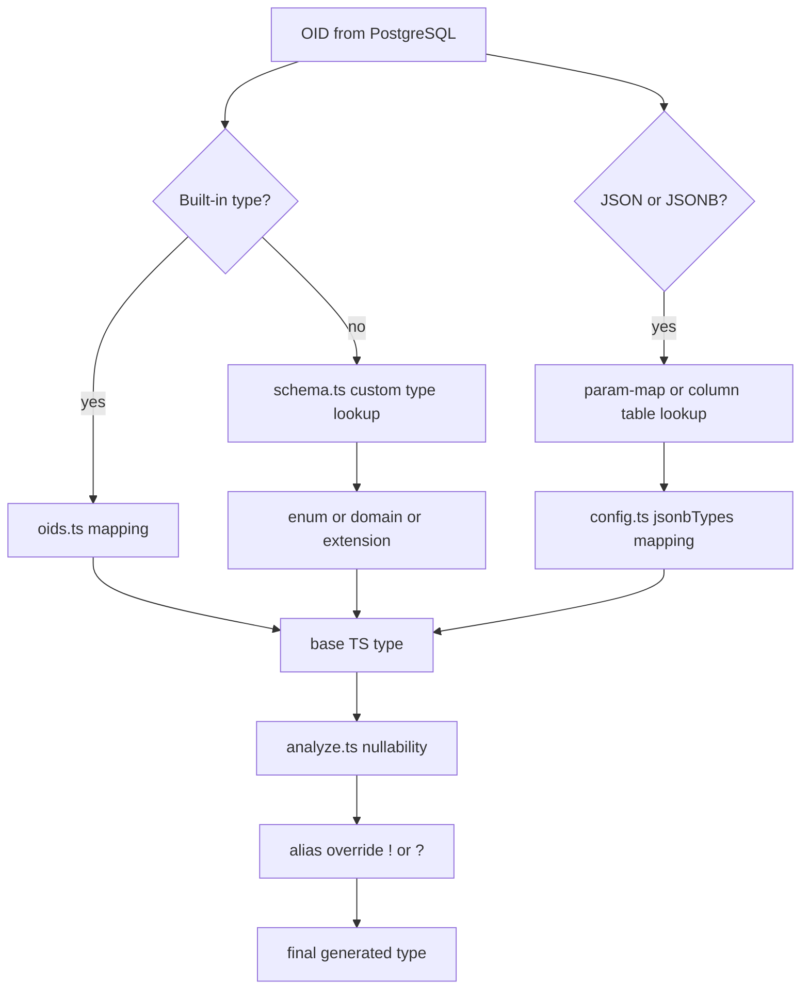

The type system in `bun-sqlx` is not just a list of OID mappings. It combines PostgreSQL metadata, AST analysis, and user configuration to decide both result-column types and parameter types. The relevant code lives in `src/pg/oids.ts`, `src/pg/schema.ts`, `src/pg/analyze.ts`, `src/pg/narrow.ts`, and the type-resolution helpers inside `src/commands/prepare.ts`.

## What This Concept Solves

Query typing is only useful if it matches real PostgreSQL behavior. A result column might be nullable because the source column allows nulls, because the query used a `LEFT JOIN`, or because the expression itself can return null. A parameter might need the TypeScript shape of a JSONB column rather than a generic `unknown`. `bun-sqlx` resolves those cases from schema and AST data instead of forcing callers to manually annotate them.

This concept depends on the prepare pipeline, but it directly affects the public `sql(...)` API. The generated types you see in `bun-sqlx.d.ts` are the output of this resolution logic.

## Internal Resolution Rules



The built-in scalar and array OID tables in `src/pg/oids.ts` cover common PostgreSQL types such as `bigint`, `text`, timestamps, arrays, network types, geometric types, and JSON/JSONB. Unknown OIDs are handed to `SchemaCache.loadCustomTypes(...)`, which reads `pg_type` and `pg_enum` and can resolve:

- enums into literal unions
- arrays of enums into arrays of literal unions
- extension or user-defined scalar types via the type registry
- domains into the base type's resolved TypeScript type

JSON and JSONB are special because the base built-in mapping is intentionally `unknown`. `resolveColumnTs(...)` and `resolveParamTs(...)` in `prepare.ts` first check whether the field or parameter points to a configured column in `jsonbTypes`. That is how `users.settings` can become `BunSqlxJson.UserSettings` for both selected rows and inserted parameters.

Nullability comes from `analyzeQuery(...)`. If PostgreSQL's row description points to a real table column, `analyze.ts` checks column `NOT NULL` metadata from `SchemaCache`, whether the table sits on the nullable side of an outer join, and whether the `WHERE` clause narrowed the column to non-null using `narrow.ts`. If the output is an expression, `expressionNullable(...)` reasons over nodes such as `COALESCE`, `CASE`, `COUNT`, `length(...)`, and casts.

## Basic Example

The example project includes a clear nullability case:

```ts
import { sql } from "bun-sqlx";

const rows = await sql(
  `SELECT id, bio FROM users WHERE bio IS NOT NULL AND id = $1`,
  1n,
);

const bio: string = rows[0]!.bio;
```

`users.bio` is nullable at the table level, but `narrowFromWhere(whereClause)` in `src/pg/narrow.ts` sees `bio IS NOT NULL`, so `analyzeQuery(...)` marks the result column as non-null.

Enums work the same way:

```ts
const user = await sql(
  `SELECT id, name, role FROM users WHERE id = $1`,
  1n,
);

user[0]!.role;
// "admin" | "editor" | "viewer"
```

That union is loaded from `pg_enum` by `SchemaCache.loadCustomTypes(...)`.

## Advanced Example

Typed JSONB and custom extension mappings are where the resolution pipeline becomes most valuable:

```ts
import type { BunSqlxConfig } from "bun-sqlx";
import { sql } from "bun-sqlx";

const config: BunSqlxConfig = {
  jsonbTypes: {
    "users.settings": "BunSqlxJson.UserSettings",
  },
  customTypes: {
    vector: "Float32Array",
  },
};

const updated = await sql(
  `UPDATE users SET settings = $1 WHERE id = $2 RETURNING id AS "id!", settings`,
  { theme: "dark", lang: "en" },
  1n,
);
```

In the shipped example, `UPDATE users SET settings = $1 ...` resolves the first parameter as `BunSqlxJson.UserSettings` because `buildParamMap(...)` can trace `$1` back to the `users.settings` column, and `lookupJsonbType(...)` can then read the configured declaration. That is one of the main differences between `bun-sqlx` and a simpler OID-only mapper.

<Callout type="warn">Use alias overrides carefully. `AS "id!"` forces a column to non-null and `AS "id?"` forces it to nullable regardless of the inference result. That is useful for `RETURNING` clauses and edge cases, but if you override incorrectly, the generated type can become more optimistic or more conservative than PostgreSQL actually is.</Callout>

## Trade-Offs

<Accordions>
  <Accordion title="Inference versus explicit alias overrides">
    The inference path is strong enough for many normal `SELECT` queries, especially when column references remain direct and joins are explicit. Still, SQL has enough edge cases that `bun-sqlx` keeps an override mechanism through alias suffixes. That is a pragmatic design choice: you get strong defaults without pretending the analyzer can perfectly model every PostgreSQL construct. The trade-off is that overrides move responsibility back to the caller, so they should be limited to places where the query author has a clear reason, such as `RETURNING id AS "id!"`.
  </Accordion>
  <Accordion title="Schema-aware JSONB types versus generic unknown">
    Mapping JSON and JSONB to `unknown` by default is safer than assuming a structure the database cannot enforce on its own. The `jsonbTypes` config lets you recover strong typing for specific columns that your application treats as structured documents. That produces excellent editor support for both reads and writes, especially when `param-map.ts` can link `$N` back to the same column. The trade-off is maintenance: if you change the JSON shape in application code, your declared global types must change with it because PostgreSQL itself still only knows the value is JSONB.
  </Accordion>
  <Accordion title="Rich built-in coverage versus conservative fallbacks">
    `src/pg/oids.ts` and `src/pg/extensions.ts` cover a broad set of built-in and popular extension types, which makes the common path pleasant. For unsupported types, `schema.ts` falls back to custom type registration or ultimately `unknown`, which is conservative but honest. This means the library does not block you from adopting custom database features. It does mean that uncommon PostgreSQL constructs, especially composites, may need a cast, a custom mapping, or a future upstream enhancement before they become fully typed.
  </Accordion>
</Accordions>

Related pages: [Typed Queries](/docs/typed-queries), [JSONB and Custom Types Guide](/docs/guides/jsonb-and-custom-types), and [Types Reference](/docs/types).
