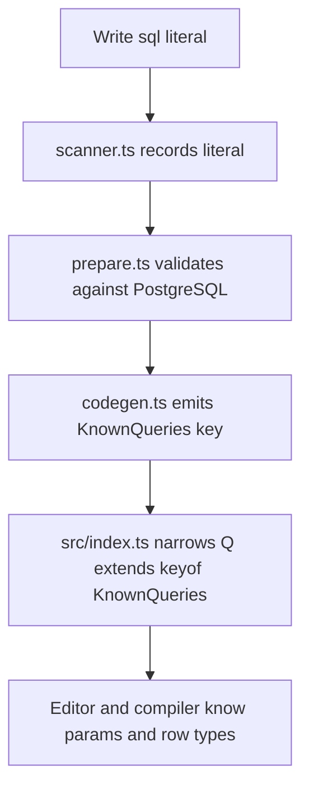

The central idea in `bun-sqlx` is simple: the query text itself is the type key. When `prepare` succeeds, `src/codegen.ts` emits a declaration file that augments the package with a `KnownQueries` interface for inline SQL and a `KnownFileQueries` interface for `sql.file(...)`. The public `TypedSql` signature in `src/index.ts` then uses those interfaces to infer the parameter tuple and row shape for each known literal.

## What This Concept Solves

Without literal-keyed typing, a helper can give you either a generic `unknown[]` result or a caller-provided type assertion, neither of which proves that the SQL string and the TypeScript type still match. `bun-sqlx` removes that duplication. The same string that Bun executes is also the string TypeScript matches in `KnownQueries`.

This concept relates directly to the prepare pipeline. The scanner in `src/scan/scanner.ts` must first find query literals, and `src/codegen.ts` must then emit declarations for those exact literals. The runtime in `src/runtime.ts` works only because the public API in `src/index.ts` already narrowed the call at compile time.

## How It Works Internally

`scanFile(absPath, root)` in `src/scan/scanner.ts` parses each TypeScript file with the TypeScript compiler API. It does three important things:

1. It finds which imported identifier names refer to `sql` from `bun-sqlx`, so alias imports still work.
2. It walks into `sql.transaction(async (tx) => ...)` and adds the callback parameter name to the allowed alias set, which is why `tx(...)` stays fully typed inside a transaction callback.
3. It rejects non-literal first arguments for both `sql(...)` and `sql.file(...)`, because a generated declaration cannot safely describe arbitrary runtime strings.

After scanning, `emitDts(outPath, entries)` in `src/codegen.ts` writes module augmentation like this:

```ts
declare module "bun-sqlx" {
  interface KnownQueries {
    "SELECT id FROM users WHERE role = $1": {
      params: ["admin" | "editor" | "viewer"];
      row: { "id": bigint };
    };
  }
}
```

The exported type in `src/index.ts` is then:

```ts
export type TypedSql = {
  <Q extends keyof KnownQueries>(
    query: Q,
    ...params: ParamsOf<KnownQueries[Q]>
  ): Promise<RowOf<KnownQueries[Q]>[]>;
  file: <P extends keyof KnownFileQueries>(
    path: P,
    ...params: ParamsOf<KnownFileQueries[P]>
  ) => Promise<RowOf<KnownFileQueries[P]>[]>;
};
```

That is the full trick. TypeScript narrows `Q` or `P` from the literal you passed, and everything else follows from the generated declaration file.



## Basic Example

This is the smallest inline-query workflow:

```ts
import { sql } from "bun-sqlx";

const user = await sql(
  `SELECT id AS "id!", name AS "name!" FROM users WHERE id = $1`,
  1n,
);

const id: bigint = user[0]!.id;
const name: string = user[0]!.name;
```

The alias suffixes matter. `prepare` records the row shape with `"id": bigint` and `"name": string`, while the runtime strips the `!` suffix from the actual result object in `renameRows(rows)` inside `src/runtime.ts`.

## Advanced Example

Typed SQL files and transactions use the same concept with a different key:

```ts
import { sql } from "bun-sqlx";

const created = await sql.transaction(async (tx) => {
  const user = await tx(
    `INSERT INTO users (name, email) VALUES ($1, $2) RETURNING id AS "id!"`,
    "Alice",
    "alice@example.com",
  );

  const posts = await tx.file("queries/count_posts.sql", user[0]!.id);

  return { userId: user[0]!.id, postCount: posts[0]!.n };
});
```

The scanner recognizes `tx` because it was the first parameter of `sql.transaction(...)`. The file-backed query is keyed by `"queries/count_posts.sql"` inside `KnownFileQueries`, not by the SQL text inside the file.

<Callout type="warn">The first argument must stay a string literal or a literal file path. `const q = "SELECT ..."; await sql(q, 1n)` fails by design because `scanFile(...)` cannot generate a stable `KnownQueries` key from a dynamic variable.</Callout>

## Trade-Offs

<Accordions>
  <Accordion title="Literal-only typing versus dynamic SQL">
    The literal-only rule is the main safety mechanism. Because the key in `KnownQueries` is the exact SQL string, the compiler can only narrow calls that use a literal known at prepare time. That means you give up some flexibility for query builders or runtime-generated SQL fragments. When a query really is dynamic, `unsafe(query, ...params)` exists for that case, but you should treat it as an explicit escape hatch rather than the default path.
  </Accordion>
  <Accordion title="Inline SQL versus sql.file">
    Inline literals are easier to co-locate with application logic and make the generated key obvious when reading `bun-sqlx.d.ts`. File-backed queries are better when SQL is large, shared, or edited by developers who want a dedicated `.sql` file. The trade-off is path stability: `src/scan/scanner.ts` resolves `sql.file(...)` against the calling file at scan time, while `src/runtime.ts` resolves the same path against `process.cwd()` at runtime. If those differ, types may exist while runtime file loading still fails.
  </Accordion>
  <Accordion title="Typed transactions versus lower-level client access">
    `sql.transaction(...)` preserves the same callable interface inside the transaction callback, which keeps application code consistent. The scanner support for the callback parameter name is a small but important detail because it lets `tx(...)` stay as typed as `sql(...)`. The cost is that the public transaction surface stays intentionally narrow. If you need direct `Bun.SQL` features outside that shape, `getClient()` and `setClient()` exist, but you then step below the library's main abstraction.
  </Accordion>
</Accordions>

Related pages: [Prepare Pipeline](/docs/prepare-pipeline), [Schema-Driven Types](/docs/schema-driven-types), and [SQL API Reference](/docs/api-reference/sql).
